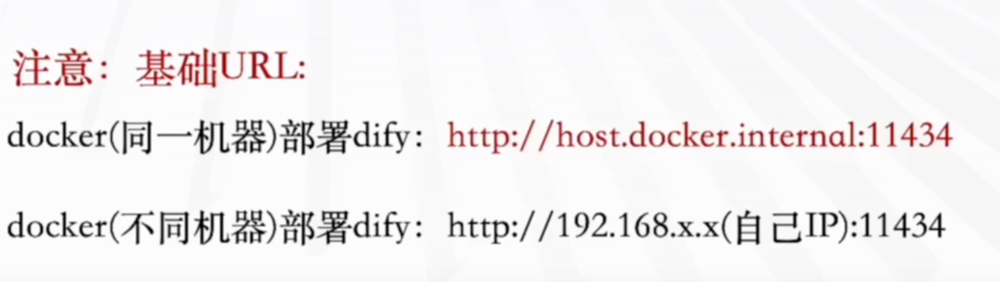
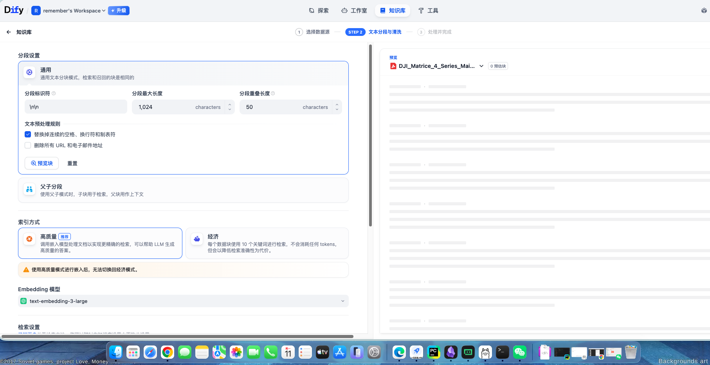
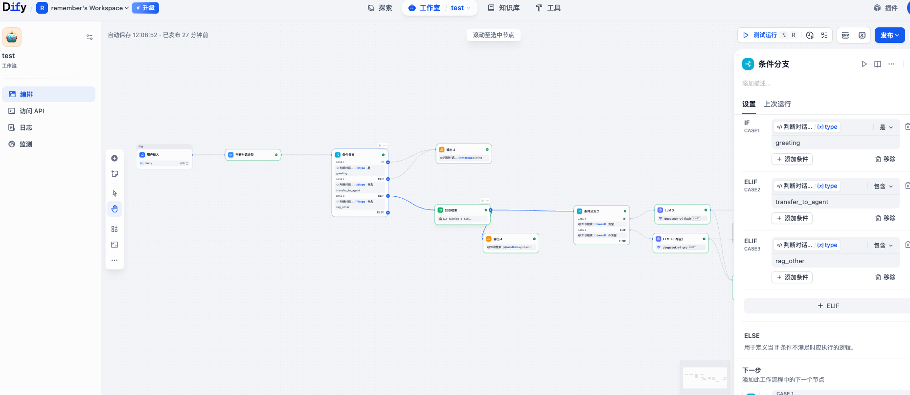

Dify 项目从零搭建全攻略

本教程将引导你一步步在本地搭建 Dify 项目，从拉取代码到创建一个完整的 RAG 工作流。

### 1. 拉取项目

首先，从 GitHub 克隆 Dify 官方仓库。

仓库地址：https://github.com/langgenius/dify

克隆命令：

bash
git clone https://github.com/langgenius/dify.git


项目克隆到本地后，进入项目目录，并切换到 docker 子目录，所有 Docker 相关的编排文件都在这里。

bash
cd dify/docker/


核心 Docker 命令

启动所有服务（后台运行）

-d 参数代表以守护进程（detached mode）方式在后台运行所有容器。

bash
docker compose up -d


停止并移除所有容器、网络

此命令会停止所有服务，并删除由 up 命令创建的容器和网络。注意：这不会删除挂载的数据卷（Volumes），你的数据库和应用数据是安全的。

bash
docker compose down


镜像拉取失败？试试这些方案

如果在执行 docker compose up -d 时，因网络问题无法从 Docker Hub 拉取镜像，可以尝试以下两种方法：

方案一：配置 Docker 代理（推荐有代理环境的用户）

如果你有 HTTP 代理服务，可以在 Docker Desktop 中直接配置。

打开 Docker Desktop，进入 Settings -> Resources -> Proxies。
开启 Manual proxy configuration。
在 HTTP 和 HTTPS 输入框中，填写你的代理地址和端口，格式通常为 http://127.0.0.1:你的代理端口号。
点击 Apply & Restart 重启 Docker Engine。

方案二：更换国内 Docker 镜像源

为 Docker Engine 配置国内可用的镜像加速地址。

打开 Docker Desktop，进入 Settings -> Docker Engine。
在 daemon.json 配置文件中，添加或修改 registry-mirrors 字段：

json
{
  "registry-mirrors": [
    "https://docker.xuanyuan.me",
    "https://docker.mirrors.ustc.edu.cn",
    "https://hub-mirror.c.163.com",
    "https://mirror.ccs.tencentyun.com"
  ]
}


点击 Apply & Restart 重启 Docker Engine，然后重新运行 docker compose up -d。

### 2. 初始化并登录项目

所有容器成功启动后，在浏览器中访问以下地址，进入 Dify 的初始化安装页面。

访问地址：http://localhost/install

在该页面，你需要设置管理员账号：

输入你的管理员邮箱。
设置一个安全的用户名和密码。
点击"设置"完成初始化。

初始化成功后，系统会自动跳转到登录页面，使用刚才设置的账号即可登录。

### 3. 接入大语言模型

Dify 的核心是编排大模型。你需要先接入一个模型服务，可以选择本地部署或接入外部 API。
方案一：使用 Ollama 部署本地模型（私有化、无网络费用）

确保你有另一个服务正在运行 Ollama。
在 Dify 的设置页面，找到 "模型供应商" -> Ollama。
填入你的 Ollama 服务地址（本机 Docker 环境通常为 http://host.docker.internal:11434）。
填写你已经 Pull 好的模型名称，如 llama3、qwen2 等。
点击"保存"即可。

方案二：接入外部模型（如 OpenAI, DeepSeek）（性能强、即开即用）

在 "模型供应商" 中找到对应的模型厂商，例如 OpenAI 或 DeepSeek。
点击"添加到接入点"，输入你从官网获取的 API Key。
点击"保存"，系统会自动获取可用模型列表。

### 4. 创建 RAG 知识库

为了让 AI 能回答基于你私有文档的问题，需要建立一个知识库。

准备文档

Dify 支持多种文本格式，如 PDF、TXT、Markdown、HTML、CSV 等。请确保文档内容是机器可读的，而非图片扫描件。

上传并分段

进入"知识库"页面，创建一个新知识库并上传你的文档。

分段策略：这是影响检索效果的关键。

最大分段长度（Chunk Size） ：设定每个文档片段能包含的最大字符数（Tokens）。太大，检索精度低；太小，易丢失上下文。
分段重叠（Overlap） ：设定相邻两个片段之间重复的字符数。这能防止关键信息在分割点被切断，建议设置为最大分段长度的 10%-20%。

选择嵌入模型（Embedding Model）

点击并选择一个嵌入模型，它会将分好段的文本转换成向量，存入向量数据库。模型的性能直接决定了检索的准确度。如果没有合适的模型，请先参考上一步接入一个支持 Embedding 的模型供应商。

检索设置（进阶）

推荐开启 混合检索（Hybrid Search） 。这种模式会同时运行关键词检索和向量检索，并结合两者优势，召回更全面的结果。
如果你希望进一步提升结果的相关性，可以接入一个 重排序模型（Rerank Model） 。工作流程是：混合检索根据设置的 TopK（如 Top 20）返回一批候选文档，然后由 Rerank 模型对这些文档进行语义重排，最终将最相关的几条（如 Top 3）输出给大模型。

### 5. 创建工作流（Chatflow / Workflow）

这是一个完整的 RAG 应用编排示例，展示了如何将知识库、大模型和逻辑判断组合成一个智能对话机器人。

流程概览

用户输入 -> 意图判断 -> 条件分支 -> 知识检索（可选） -> 结果处理与回复

详细步骤与配置

开始节点 - 接收用户输入

在工作流画布上创建一个"开始"节点。
新增一个输入字段，命名为 query，类型为文本。它将接收用户的原始问题。

代码节点 - 对话意图分类

创建一个"代码"节点，用于判断用户意图。
将上一步的 query 作为输入变量。
在代码编辑器中粘贴以下 Python 脚本。这段代码会将用户问题分类为三种类型：greeting（招呼）、transfer_to_agent（转人工）、rag_other（知识库查询）。

```python
import json

def main(query):
    """
    根据用户输入内容判断意图类型并返回对应对象
    """

    # 定义打招呼的关键词列表
    greeting_keywords = ['你好', '你好呀', '嗨', 'hello', 'hi', '在吗', '早上好', '中午好', '晚上好', '哈喽']

    # 定义转人工的关键词列表
    transfer_keywords = ['转人工', '人工客服', '人工服务', '转人工客服', '我要人工']

    # 转换为小写便于比较
    input_lower = query.strip().lower()

    # 判断是否为打招呼
    if any(keyword in input_lower for keyword in greeting_keywords):
        return {
            "type": "greeting",
            "message": "你好！有什么可以帮助你的吗？",
            "original_input": query
        }

    # 判断是否为转人工
    elif any(keyword in input_lower for keyword in transfer_keywords):
        return {
            "type": "transfer_to_agent",
            "message": "转人工客服请求",
            "original_input": query
        }

    # 其他类型（包括知识查询）
    else:
        return {
            "type": "rag_other",
            "message": "执行知识库检索",
            "original_input": query
        }

```
条件分支节点 - 根据意图分流

创建一个"条件分支"节点。
引用代码节点的输出变量 type 作为判断条件。
设置三个分支，分别对应不同的 type 值：greeting、transfer_to_agent、rag_other。

知识检索节点（RAG 分支）

在 rag_other 的分支下，创建一个"知识检索"节点。
选择你之前创建好的知识库。
在"查询"输入框中，引用开始节点的 query 变量。
设置合理的召回模式和 TopK 数量，如启用混合检索并召回 Top 3-5 个片段。

检索结果判空（RAG 分支）

为避免检索结果为空时，大模型产生幻觉，我们增加一个"条件分支"或"变量聚合"逻辑。这里推荐在 LLM 节点的提示词中进行空值处理。

创建一个 LLM 节点，将"知识检索"节点的输出 result 和用户的 query 一并传给大模型。
在 LLM 的系统提示词中，填入以下优化版模板：

```text
# 角色
你是大疆创新的官方智能客服助手，一个专业、耐心、严谨的无人机技术顾问。你的知识严谨地来源于官方提供的技术文档。

## 核心行为准则
1. **忠于文档**：只根据下文提供的【参考文档】进行回答。如果文档中没有相关信息，就坦诚告知用户你不知道，严禁编造或推测。
2. **安全第一**：所有涉及电池、电力系统、飞行安全的操作，必须在回答中附加醒目的安全提示。
3. **格式清晰**：善用标题、列表和**加粗**来组织信息，让回答一目了然。

## 回答策略
- **有相关文档时**：
  - 条理清晰地解答用户问题。
  - 关键步骤按 1. 2. 3. 顺序列出。
  - 在回答末尾注明信息来源：`（参考来源：《xxx文档》）`
- **无相关文档时**：
  - "很抱歉，我查阅了现有的技术资料，没有找到关于 [用户问题] 的明确信息。为了保障信息的准确性，不建议我凭猜测回答。"
  - 请提供替代方案："建议您通过 [大疆官网](www.dji.com) 的技术支持页面、官方社区或联系人工客服获取最可靠的帮助。"

## 当前查询场景
- 如果用户是打招呼，请友好回应并引导其提问。
- 如果用户要求转人工，请表示理解并提供指引。
- 如果是知识查询，请严格按照上述策略执行。

## 用户问题
{{#开始节点.query#}}

## 参考文档
{{#知识检索节点.result#}}


直接回复节点（招呼与转人工分支）

在 greeting 和 transfer_to_agent 两个分支下，分别创建一个"直接回复"节点。

招呼分支：回复内容可设置为 "你好！我是大疆智能助手，请问有什么关于无人机的问题可以帮助你？"
转人工分支：回复内容可设置为 "好的，我理解你希望联系人工客服。请问你具体遇到了什么问题？我可以先帮你整理信息，以便更快地为你转接。"

结束节点 - 最终输出

将所有分支（直接回复节点和 LLM 节点）的输出都连接到"结束"节点。
在结束节点上，定义最终的输出变量为每个分支的回复文本。

最终工作流校验与测试

校验：画布编辑完成后，检查所有节点的连接和配置是否正确。
发布：点击右上角的"发布"按钮。每次修改工作流后，都需要重新发布才能让 API 和公开访问 URL 生效。
测试：在右侧的调试面板中，输入不同意图的问题，观察每个分支是否被正确触发，LLM 对 RAG 文档的解读是否准确、安全提示是否到位。
```
